# My Checklists

A Zepp OS smartwatch app for reusable daily checklists — pack for a swim, gear up for a bike ride, or build any list you use over and over. Edit lists on your phone in the Zepp app; check items off on your watch.

> **About this repository**  
> This public repo is the **documentation and community hub** for My Checklists.  
> Use [Issues](https://github.com/michalowskil/my-checklists/issues) to report bugs, and [Discussions](https://github.com/michalowskil/my-checklists/discussions) for feature requests, questions, and ideas.  
> The application source code is maintained in a **private** repository and is not published here.

---

## Table of contents

- [Overview](#overview)
- [Getting started](#getting-started)
- [Phone app (Zepp companion settings)](#phone-app-zepp-companion-settings)
- [Watch app](#watch-app)
- [How sync works](#how-sync-works)
- [Free trial vs full version](#free-trial-vs-full-version)
- [Supported devices](#supported-devices)
- [Feedback](#feedback)

---

## Overview

My Checklists helps you manage **multiple named checklists** with **items you can tick off on the watch**. When everything is packed or done, reset the list and use it again the next day.

Typical uses:

- Things to take to the **swimming pool** (swimsuit, towel, goggles, …)
- Gear for a **bike ride** (helmet, spare tube, pump, …)
- A **recurring shopping list** (milk, bread, fruit, …) — check items off in the store, then reset the list for next time

**Where you do what:**

| Task | Phone (Zepp app) | Watch |
|------|------------------|-------|
| Create, rename, delete checklists | ✓ | |
| Add, edit, delete, reorder items | ✓ | |
| Reorder checklists | ✓ | |
| Check / uncheck items | | ✓ |
| Reset all items in a list | | ✓ |
| Adjust row height, reopen-on-wake | | ✓ |
| Keep screen on while packing | | ✓ |

On first install, the app includes two **sample checklists** (*Swimming pool* and *Bike ride*) so you can try it immediately.

---

## Getting started

1. Install **My Checklists** on your Amazfit / Zepp watch from the Zepp app (Mini App Store).
2. Open the app on your watch and wait for the initial sync with your phone (you may briefly see **Syncing…**).
3. On your phone, open the Zepp app → **Device** → **App settings** → **My Checklists** to edit lists.
4. Changes made on the phone sync to the watch when the devices are connected.

---

## Phone app (Zepp companion settings)

The phone side is where you **build and maintain** your checklists. Open it from the Zepp app while your watch is paired.

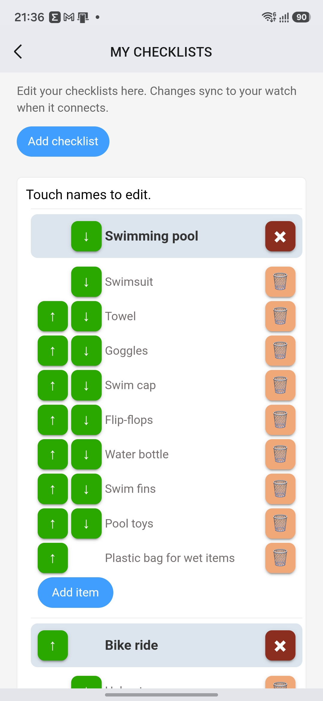

### Checklists

- **Add a checklist** — use the **Add checklist** field at the top; the list is created as soon as you enter a name.
- **Rename a checklist** — tap the checklist name and edit it (max **200 characters**).
- **Delete a checklist** — tap the **✖** button next to the name; confirm with **Delete** or cancel.
- **Reorder checklists** — use the **↑** / **↓** buttons (shown when you have two or more lists).
- **Duplicate names** are not allowed (case-insensitive).

### Items

- **Add an item** — use **Add item** at the bottom of each checklist.
- **Rename an item** — tap the item name and edit it (max **200 characters**).
- **Delete an item** — tap the **🗑** button; confirm or cancel.
- **Reorder items** — use **↑** / **↓** (shown when a list has two or more items).
- **Duplicate item names** within the same checklist are not allowed.

### Validation and messages

- Empty names or names longer than 200 characters are rejected with an error message.
- In the **free trial** (first **90 days**), adding a third checklist shows:  
  *"You already have 2 checklists. That is the maximum during the free trial. Open Settings in the watch app and tap Buy full version for unlimited checklists."*
- After the **90-day trial ends**, adding checklists is blocked until you purchase; the message is:  
  *"Your 3-month trial has ended. Open Settings in the watch app and tap Buy full version to keep using the app with unlimited checklists."*

---

## Watch app

### Main screen — checklist list

When you open My Checklists on the watch, you see all your checklists as tappable rows.

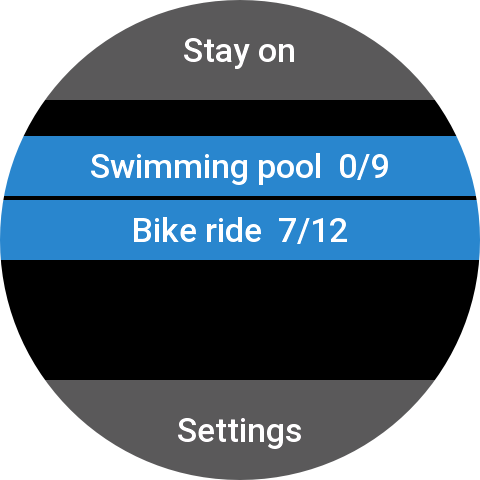

| Control | Description |
|---------|-------------|
| **Stay on** (top bar) | Toggle to keep the screen awake while you pack. Blue = on, gray = off. Useful when checking many items in a row. |
| **Checklist buttons** | Tap a checklist to open its items. |
| **Settings** | Opens watch-specific display and purchase options. |

**Stay on enabled** (blue top bar):

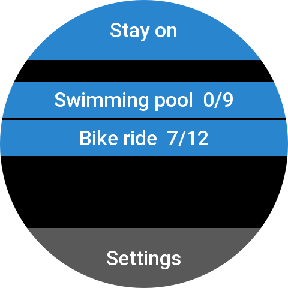

**Empty state:** If you have no checklists yet, the watch shows:  
*"No checklists yet. Create them in the Zepp app on your phone."*

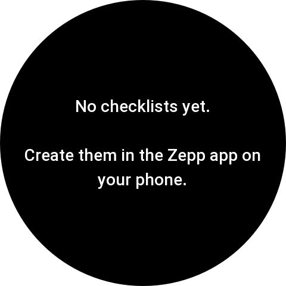

**First launch:** If nothing is cached on the watch yet, you may see **Syncing…** until data arrives from the phone.

---

### Item screen — checking things off

Tap a checklist to see its items. This is where you use the list day to day.

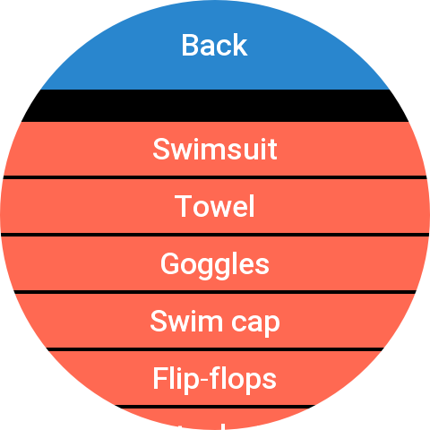

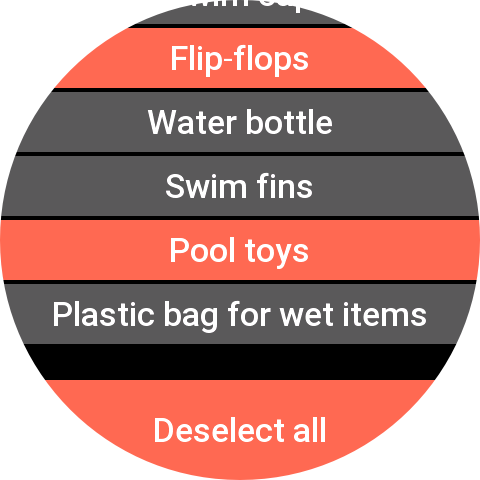

| Control | Description |
|---------|-------------|
| **Back** (top) | Return to the checklist list. |
| **Item rows** | Tap an item to toggle it between **to pack** (red) and **done** (gray). |
| **Deselect all** (bottom) | Resets every item in this list back to **to pack** (red) so you can reuse the list next time. |

**Empty list:** If a checklist has no items, the watch shows *"No items yet."* — add items on the phone.

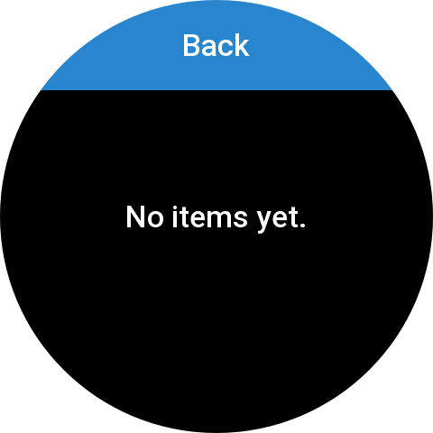

---

### Settings screen (watch)

Open **Settings** from the main watch screen.

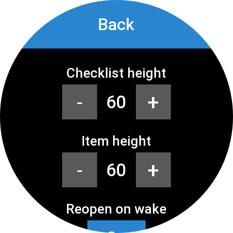

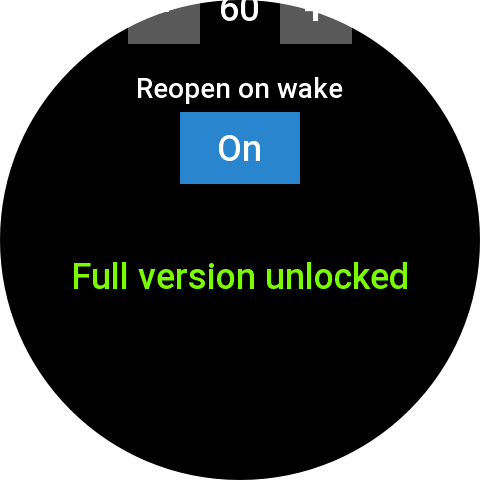

| Setting | Description |
|---------|-------------|
| **Checklist height** | Row height for checklist names on the main screen (48–96 px, step 4). Adjust if names are clipped or you want more lists on screen. |
| **Item height** | Row height for items inside a checklist (48–96 px, step 4). |
| **Reopen on wake** | **On** (default): when the watch screen turns back on, the app reopens where you left off. **Off**: the app closes normally when the screen sleeps. Works whether you wake the screen with a button, touch, or wrist gesture. |
| **Buy full version** | Starts the in-app purchase flow (KiezelPay). Hidden once licensed; replaced by **Full version unlocked**. |

Tap **Back** to save layout changes and return to the main screen.

---

## How sync works

- **Phone → watch:** Checklist names, item names, and order are edited on the phone and pushed to the watch over Bluetooth when connected.
- **Watch-only data:** Which items are checked off (**red** vs **gray**) is stored on the watch. When lists are updated from the phone, your checked states for **unchanged item names** are preserved.
- **Offline watch:** Previously synced lists remain available on the watch; new edits from the phone apply the next time devices connect.
- **Renamed or removed items** on the phone may reset the checked state for those entries on the next sync.

---

## Free trial vs full version

My Checklists uses a **90-day free trial**, then a **one-time purchase of $2.00** for the full version.

| | During 90-day trial | After trial (not purchased) | Full version (**$2.00**) |
|---|---------------------|----------------------------|--------------------------|
| Checklists | Up to **2** | Must purchase to add lists | **Unlimited** |
| Items per checklist | Unlimited | Unlimited (existing lists) | Unlimited |
| All watch features | ✓ | ✓ (existing lists on watch) | ✓ |

To upgrade, open **Settings** on the watch and tap **Buy full version** (any time during or after the trial). Payment is handled via **KiezelPay**; after purchase the settings screen shows **Full version unlocked**.

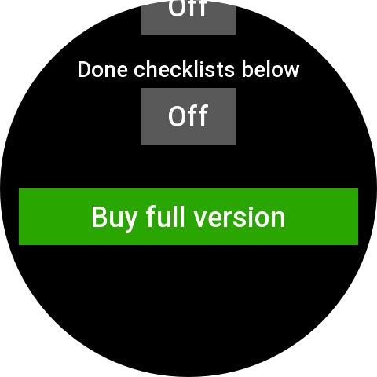

KiezelPay then shows a payment code — enter it at [kzl.io/code](https://kzl.io/code) on your phone or computer:

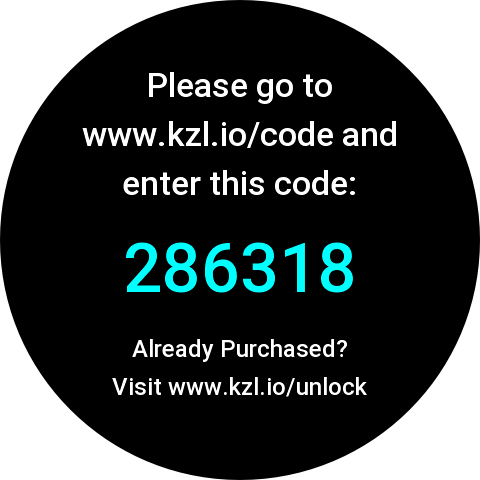

If you already purchased, use [kzl.io/unlock](https://kzl.io/unlock) instead.

---

## Supported devices

My Checklists requires **Zepp OS 2.0+**. The app is built for the following Amazfit watches:

- Amazfit Active 2 Round
- Amazfit Active 2 Square
- Amazfit Active 3 Premium
- Amazfit Active Edge
- Amazfit Active Max
- Amazfit Balance
- Amazfit Balance 2
- Amazfit Balance 3
- Amazfit Balance Ultra
- Amazfit Bip 5
- Amazfit Bip 5 Core
- Amazfit Bip 5 Unity
- Amazfit Bip 6
- Amazfit Bip Max
- Amazfit Cheetah 2 Pro
- Amazfit Cheetah 2 Ultra
- Amazfit Cheetah Pro
- Amazfit Falcon
- Amazfit GTR 4
- Amazfit GTR Mini
- Amazfit GTS 3
- Amazfit GTS 4
- Amazfit T-Rex 2
- Amazfit T-Rex 3
- Amazfit T-Rex 3 Pro
- Amazfit T-Rex Ultra 2

If the app is not yet available for your model in the store, open a [Discussion](https://github.com/michalowskil/my-checklists/discussions) and mention your watch — support expands as new Zepp OS 2.0 devices are added.

---

## Feedback

- **Bug reports:** [GitHub Issues](https://github.com/michalowskil/my-checklists/issues)
- **Feature requests, questions & ideas:** [GitHub Discussions](https://github.com/michalowskil/my-checklists/discussions)

When reporting a problem, please include your **watch model**, **Zepp app version**, and **My Checklists version** if known. Screenshots or screen recordings help a lot.

---

## Version

Current app version: **1.0.0**.
